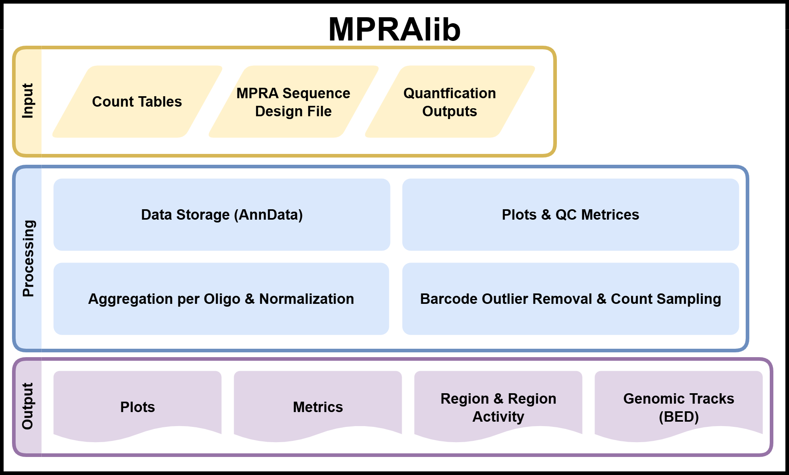

.. _Overview:

=====================
Overview
=====================

MPRAlib is a library designed to analyze sequencing data from Massively Parallel Reporter Assays (MPRAs) from count tables for candidate sequences tested in the experiment.

Here is a schematic overview of MPRAlib:

The main input consists of counts tables (primary data) containing DNA and RNA counts from MPRA experiments. These counts are assigned at either the oligo level or barcode level and are stored in an efficient data structure using `AnnData <https://anndata.readthedocs.io>`_. Count data from the MPRA pipeline `MPRAsnakeflow <https://doi.org/10.5281/zenodo.18163777>`_ can be directly used and is recommended for pre-processing the data.

With the MPRAlib data structure several options are possible. It can aggregate barcode level counts to oligo level counts, perform normalization and filtering of the data (barcode outlier detection, or sampling) without losing the main input. QC metrics like correlation across replicates or sample complexity can be computed and it provides different plot options to visualize the data.

Pairing the data with other metadata like a design table and quantification outputs from other tools like BCalm or mpralm the library can generate browsable genome tracks (BED files) to visualize the MPRA results.

MPRAlib can be used as library within your python code and some common used functionality is available as command line interface (CLI).

For more information on how to install and use MPRAlib, please refer to the :doc:`getting-started` guide. If you want to learn all command line options, please refer to the :doc:`cli`. Using the API we recommend to look at the :doc:`../tutorial/tutorial` and the :doc:`../mpralib`.
