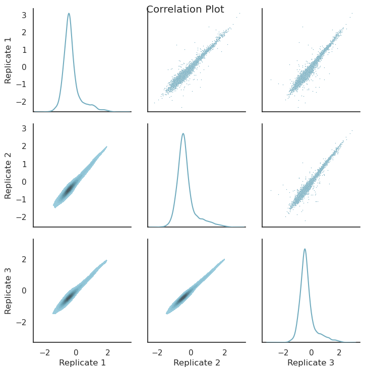

.. _Getting started:

=====================
Getting Started
=====================

After :doc:`install` is complete we try to see if the installation was successful by running the command line interface (CLI) help command:

.. code-block:: console

    mpralib --help

It should show the help message with all available commands and options, like this:

.. code-block:: text

    Usage: mpralib [OPTIONS] COMMAND [ARGS]...

    Command line interface of MPRAlib, a library for MPRA data analysis.

    Options:
    --help  Show this message and exit.

    Commands:
    combine        Combine counts with other outputs.
    functional     General functionality.
    plot           Plotting functions.
    validate-file  Validate standardized MPRA reporter formats.

If you see this message, the installation was successful. You can now start using MPRAlib either via the command line interface or as a library within your python code. We recommend to look at the :doc:`../tutorial/tutorial` and the :doc:`../mpralib` for using the API or the :doc:`cli` for using the command line interface. For a quickstart we provide one CLI and one API example below.

As a quick example we will read the example barcode count file and computing correlation across replicates and plot them. We will do this with the command line interface as well as through the python API.

Preparing Example Data
-----------------------

First we download an example barcode count file to work with using wget from our MPRAlib repository on GitHub:

.. code-block:: console

    wget https://github.com/kircherlab/MPRAlib/raw/refs/tags/v0.9.0/resources/barcode_counts.tsv.gz -O example_barcode_counts.tsv.gz

Command Line Interface Example
-------------------------------

Now we can use the command line interface to compute correlation across replicates and plot them. We will use the ``functional compute-correlation`` command for this. The input is the barcode count file we just downloaded. We want to compute correlation for the activity (log2 normalized RNA over normalized DNA ratio) using ``--correlation-on activity``.

.. code-block:: console

     mpralib functional compute-correlation \
     --input example_barcode_counts.tsv.gz \
     --correlation-on activity

This will compute spearman and pearson correlation across all 3 replicates. The result should look like this:

.. code-block:: text

    pearson correlation on Modality.ACTIVITY: [0.967308   0.9596891  0.97339666]
    spearman correlation on Modality.ACTIVITY: [0.9279497  0.92303765 0.94871825]

We can also set a minimum number of required barcodes per oligo to remove noisy oligos using ``--bc-threshold 10`` and rerun the command:

.. code-block:: console

     mpralib functional compute-correlation \
     --input example_barcode_counts.tsv.gz \
     --correlation-on activity \
     --bc-threshold 10

We should see a slight increase in the correlation values:

.. code-block:: text

    pearson correlation on Modality.ACTIVITY: [0.97747856 0.9760033  0.98485214]
    spearman correlation on Modality.ACTIVITY: [0.9380415 0.9349714 0.9591882]

To plot the correlation across replicates use the ``plot correlation`` command:

.. code-block:: console

     mpralib plot correlation \
     --input example_barcode_counts.tsv.gz \
     --modality activity \
     --output correlation_plot.png

The image ``example_correlation_plot.png`` should look similar like this:

Python API Example
-------------------

We can do the same using the python API. Please start the python console, create a python file, or use a notebook. First we import the library  and read in the barcode count file:

.. code-block:: python

    import mpralib

    # Read in barcode count file
    mpra_barcode_data = mpralib.mpradata.MPRABarcodeData.from_file("example_barcode_counts.tsv.gz")

Now we compute the correlation of the oligo data. Because we have the data on a barcode level we first have to aggregate to get to the oligo level. This is simply generating an ``MPRAOligoLevelData`` object with the ``oligo_data`` getter. Then we can use the ``correlation`` method to compute correlation across replicates on the activity level.

.. code-block:: python

    # Aggregate to oligo level
    mpra_oligo_data = mpra_barcode_data.oligo_data

    # Compute correlation on activity
    print("🔗 Pairwise Pearson correlation (activity, log2 RNA/DNA ratio):")
    activity_corr = mpra_oligo_data.correlation()
    print(activity_corr)

The output should be:

.. code-block:: text

    🔗 Pairwise Pearson correlation (activity, log2 RNA/DNA ratio):
    [[1.         0.967308   0.9596891 ]
     [0.967308   1.         0.97339666]
     [0.9596891  0.97339666 1.        ]]

We can also set a barcode threshold and recompute again:

.. code-block:: python

    # Compute correlation on activity with barcode threshold
    print("🔗 Pairwise Pearson correlation (activity, log2 RNA/DNA ratio) with barcode threshold 10:")
    mpra_oligo_data.barcode_threshold = 10
    activity_corr_bc_thresh = mpra_oligo_data.correlation()
    print(activity_corr_bc_thresh)

The output should be:

.. code-block:: text

    🔗 Pairwise Pearson correlation (activity, log2 RNA/DNA ratio) with barcode threshold 10:
    [[1.         0.97747856 0.9760033 ]
     [0.97747856 1.         0.98485214]
     [0.9760033  0.98485214 1.        ]]

Now let's plot it. To get the same plot as before we have to set the BC threshold back to none (or zero).

.. code-block:: python

    # Plot pairwise correlation heatmap for oligo activities
    from mpralib.utils.plot import correlation
    import matplotlib.pyplot as plt

    mpra_oligo_data.barcode_threshold = None
    plt = correlation(mpra_oligo_data, mpralib.mpradata.Modality.ACTIVITY)
    plt.show()
